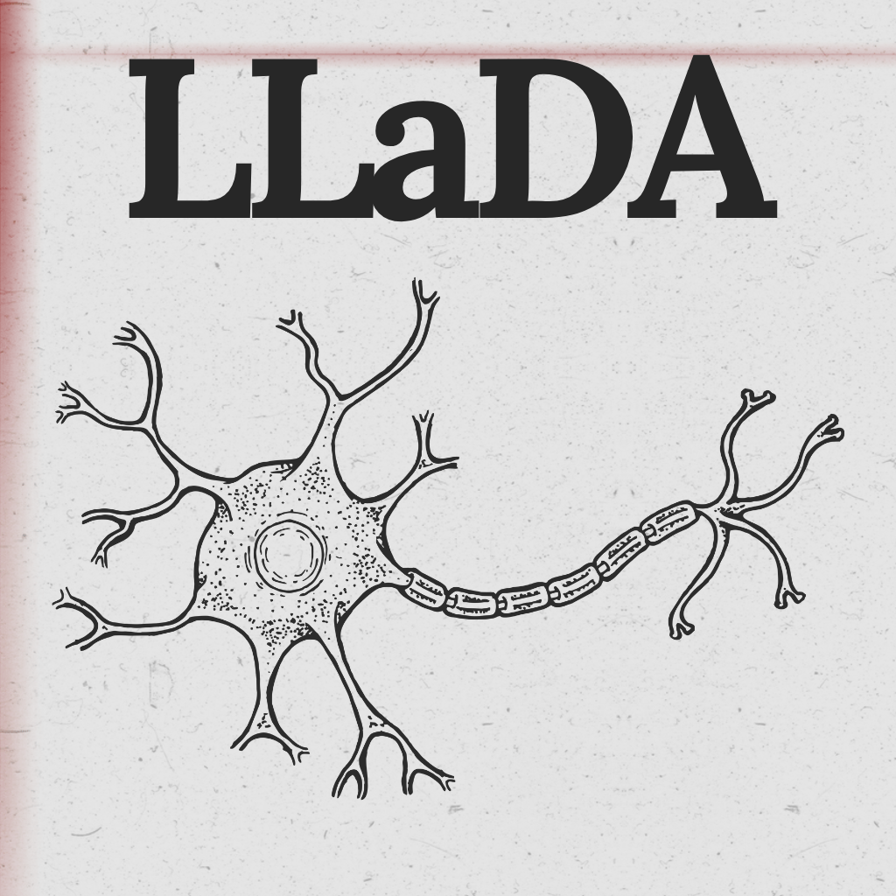
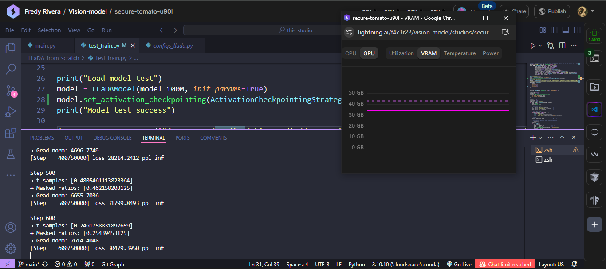

<h1 align="center">🚀 LLaDA-from-scratch</h1>

<div align="center">
  
</div>

💡 I'm curious to implement LLaDA from scratch (For now I'm going to use what's in: [huggingface-modeling](https://huggingface.co/GSAI-ML/LLaDA-8B-Instruct/blob/main/modeling_llada.py) as a base, from there I'll implement a 1B model to be trained from scratch)

LLaDA is a diffusion model for natural language that, unlike traditional autoregressive models, learns to model the distribution of text through a process of progressive data masking and its inverse reconstruction.

## 🔤 Tokenizer

To reduce complexity and implement LLaDA more quickly from scratch, we are going to reuse the tokenizer from [GSAI-ML/LLaDA-8B-Instruct](https://huggingface.co/GSAI-ML/LLaDA-8B-Instruct)

## 📚 References for building LLaDA 1B from scratch

- [LLaDA-GitHub](https://github.com/ML-GSAI/LLaDA)
- [LLaDA-v1.5-GitHub](https://github.com/ML-GSAI/LLaDA-1.5)
- [LLaDA-Paper](https://arxiv.org/abs/2502.09992)
- [LLaDA-v1.5-Paper](https://arxiv.org/abs/2505.19223)
- [GSAI-ML/LLaDA-8B-Instruct](https://huggingface.co/GSAI-ML/LLaDA-8B-Instruct/tree/main)
- [GSAI-ML/LLaDA-1.5](https://huggingface.co/GSAI-ML/LLaDA-1.5/tree/main)

## 🛠️ Implementation Notes

It's important to clarify that the base architecture of the model (defined in [`modeling_llada.py`](https://huggingface.co/GSAI-ML/LLaDA-8B-Instruct/blob/main/modeling_llada.py)) already contains all necessary components to initialize and run LLaDA. Therefore, there is no need to redesign or significantly modify the model architecture itself.

The main objective of this project is to:

* Reuse the existing architecture.
* Implement the **data preparation pipeline** (tokenization, masking, and formatting).
* Create the **training loop** from scratch.
* Optionally, implement a **fine-tuning script** for adapting the pretrained model to specific downstream tasks.

## 💾 Dataset
The dataset we will use for training will be [HuggingFaceFW/fineweb](https://huggingface.co/datasets/HuggingFaceFW/fineweb) in the `sample-10BT` subset

- **Processed version:** [Fredtt3/LLaDA-Sample-10BT](https://huggingface.co/datasets/Fredtt3/LLaDA-Sample-10BT)  
  - Sharded into 252 `.pt` files  
  - ~2,520,000 chunks of up to 4,096 tokens (1% random-length)  
  - Noisy masking (ε=1×10⁻³)  
  - Total size: ~166 GB  
  - Ready to load with `torch.load`

## ✅ Training Test & Sample Output

<div align="center">
  
</div>

Above is a screenshot of the training log using the `LLaDA-from-scratch` pipeline.
The model successfully loaded \~100,000 samples and started training on a custom 100M-parameter architecture.

**Observed output (first steps):**

```
Step 1
→ t samples: [0.6147753581140875]
→ Masked ratios: [0.607666015625]
→ Grad norm: 55434.2188

Step 100
→ t samples: [0.2798628363990283]
→ Masked ratios: [0.29052734375]
→ Grad norm: 25795.6152
[Step    100/50000] loss=43529.4223 ppl=inf

Step 200
→ t samples: [0.9550417467839245]
→ Masked ratios: [0.960205078125]
→ t samples: [0.9550417467839245]
→ Masked ratios: [0.960205078125]
→ Masked ratios: [0.960205078125]
→ Grad norm: 10642.7139
[Step    200/50000] loss=33367.0787 ppl=inf

Step 300
→ t samples: [0.8756005540746886]
→ Masked ratios: [0.874755859375]
→ Grad norm: 6360.4556
[Step    300/50000] loss=34664.3667 ppl=inf

.....

Step 4700
→ t samples: [0.2735590914025805]
→ Masked ratios: [0.288818359375]
→ Grad norm: 5315.8374
[Step   4700/50000] loss=28526.8933 ppl=inf

Step 4800
→ t samples: [0.07394501204994786]
→ Masked ratios: [0.073486328125]
→ Grad norm: 5412.4941
[Step   4800/50000] loss=26879.4525 ppl=inf

Step 4900
→ t samples: [0.8257861493236259]
→ Masked ratios: [0.823486328125]
→ Grad norm: 3085.1841
[Step   4900/50000] loss=27260.0180 ppl=inf

Step 5000
→ t samples: [0.7302043841254092]
→ Masked ratios: [0.726318359375]
→ Grad norm: 2694.6125
[Step   5000/50000] loss=27371.1092 ppl=inf
```

> ℹ️ Training is running on an A100 42GB GPU and uses:
>
> * **Gradient checkpointing** via `model.set_activation_checkpointing(...)`
> * **Streaming dataset** loaded into CPU RAM and batched on-demand to GPU
> * **Mixed precision (fp16/bfloat16)** where possible

## 🧪 Generation Test with Dummy Model

This repository includes a quick generation test script using a dummy model located in [`test_gen.py`](test_gen.py).
This is not meant for quality evaluation but rather to validate that the architecture and generation logic work end-to-end.

* 🧠 The model used is a **tiny 310M parameter LLaDA model**, trained only for **200 steps** on a **mini dataset of 40,960 tokens**.
* ⚠️ **Disclaimer:** This model is **not competent** and does not produce meaningful completions. It's only intended to verify that inference runs successfully.
* ✅ It is fully **compatible with Hugging Face Transformers** and uses the same generation logic.

You can run it locally or directly in [Google Colab](https://colab.research.google.com/drive/1jPIPu9qHEFMkANzUEkeOxUW6hS3DeVwd?usp=sharing) 🚀

```bash
python test_gen.py
```

## 📤 How to Upload the Model to Hugging Face

Once you’ve trained your model using `pre_train.py`, a compatible Hugging Face checkpoint is saved every `save_every` steps using:

```python
if step % save_every == 0:
    checkpoint_dir = output_dir / f"llada_ckpt_{step:06d}"
    checkpoint_dir.mkdir(parents=True, exist_ok=True)

    # Save the model in transformers format
    hf_model.save_pretrained(checkpoint_dir)
    tokenizer.save_pretrained(checkpoint_dir)
```

To make your model fully usable with `transformers`, follow these steps before uploading to Hugging Face:

1. In your `config.json`, make sure to define your architecture and `auto_map` field:

```json
"architectures": [
  "LLaDAModelLM"
],
"auto_map": {
  "AutoConfig": "configs_llada.LLaDAConfig",
  "AutoModelForCausalLM": "model.LLaDAModelLM",
  "AutoModel": "model.LLaDAModelLM"
}
```

2. Copy the following files into the same directory as your checkpoint:

   * `model.py` (containing `LLaDAModelLM`)
   * `configs_llada.py` (containing `LLaDAConfig`)

3. Upload the entire directory (including `model.safetensors or other`, `tokenizer.json`, `config.json`, etc.) to the Hugging Face Hub using:

```bash
huggingface-cli login
huggingface-cli upload your-username/llada-test-model ./llada_ckpt_xxxxx
```

Your model will now be accessible and usable like any other Hugging Face `transformers` model! 🎉


## 🙏 Acknowledgments

- The [ML-GSAI](https://github.com/ML-GSAI) team for the original architecture